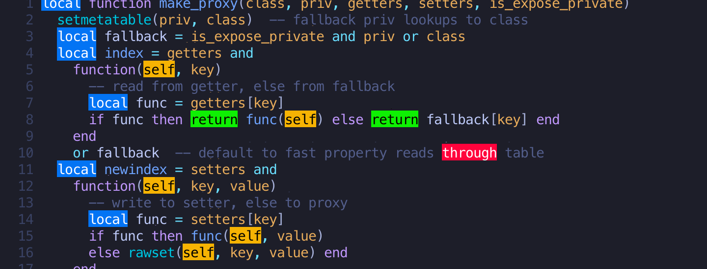

# Hlwords.nvim

Highlight multiple different words at the same time. That's all.



> I really loved [vim-quickhl](https://github.com/t9md/vim-quickhl).  
> Wrote this plugin in Lua with **a lot of** hints from [interestingwords.nvim](https://github.com/Mr-LLLLL/interestingwords.nvim).  
> Thanks.

## Requirements

- Neovim >= 0.9.5
  - Because it was developed with this version. Since it is simple, I think it will work even in lower versions.

## Installation & Configuration

Install the plugin with your preferred package manager. Here is an example in [lazy.nvim](https://github.com/folke/lazy.nvim).  
Please also refer to the sample contents regarding configurations.

```lua
{
  'AT-AT/hlwords.nvim',

  -- This plugin does not provide a default keymap. Below is an example.
  -- By registering with the "keys" option, you can also perform lazy loading at the same time.
  keys = {

    -- Toggles highlighting of the word (<word>) under the cursor.
    {
      '<leader>hh',
      function()
        require('hlwords').toggle()
      end,
    },

    -- Toggle highlighting current selection.
    -- Note that "V-LINE" mode is not applicable, and it's possible to select a range spanning
    -- multiple lines in "V-BLOCK" mode but it doesn't make much sense.
    {
      '<leader>hh',
      function()
        require('hlwords').toggle()
      end,
      mode = 'x',
    },

    -- Remove all highlights.
    {
      '<leader>hc',
      function()
        require('hlwords').clear()
      end,
    },
  },

  config = function()
    -- Below are the configurable options and their default values.
    require('hlwords').setup({

      -- Highlight colors.
      -- We only provide primitive highlight colors, so change them to match your colorscheme.
      -- Any number of option (highlight definition map, Lua table) that can be specified in
      -- nvim_set_hl() can be specified.
      -- No more highlighting than the specified number of colors will be performed.
      -- See: https://neovim.io/doc/user/api.html#nvim_set_hl()
      colors = {
        { fg = '#000000', bg = '#00ffff' },
        { fg = '#ffffff', bg = '#ff00ff' },
        { fg = '#000000', bg = '#ffff00' },
        { fg = '#ffffff', bg = '#444444' },
      },

      -- Priority order when highlights overlap.
      -- See: https://neovim.io/doc/user/builtin.html#matchadd()
      highlight_priority = 10,

      -- Order of use of highlight colors.
      -- If false, they will be used in the order specified in the "colors" option.
      random = true,

      -- Handling of words specified in normal mode.
      -- When highlighting is executed in normal mode, a pattern including word boundaries is
      -- registered ('\\<' .. word .. '\\>') in interestingwords.nvim, but not in vim-quickhl.
      -- If set to false, the match pattern will no longer represent exact words, so the behavior
      -- will be similar to vim-quickhl.
      strict_word = false,
    })

    -- If you do not specify a keymap with the "keys" option, please set it as follows.
    -- vim.keymap.set('n', '<leader>hh', function() require('hlwords').toggle() end)
    -- vim.keymap.set('x', '<leader>hh', function() require('hlwords').toggle() end)
    -- vim.keymap.set('n', '<leader>hc', function() require('hlwords').clear() end)
  end,
}
```

## Usage

- Toggle highlighting of the word under the cursor.
- Toggle current selection highlighting.
- Remove all highlights.

No default keymap is provided, so please refer to the example above to configure it.

## Related Plugins

- [interestingwords.nvim](https://github.com/Mr-LLLLL/interestingwords.nvim)
- [high-str.nvim](https://github.com/pocco81/high-str.nvim)
- [hi-my-words.nvim](https://github.com/dvoytik/hi-my-words.nvim)

